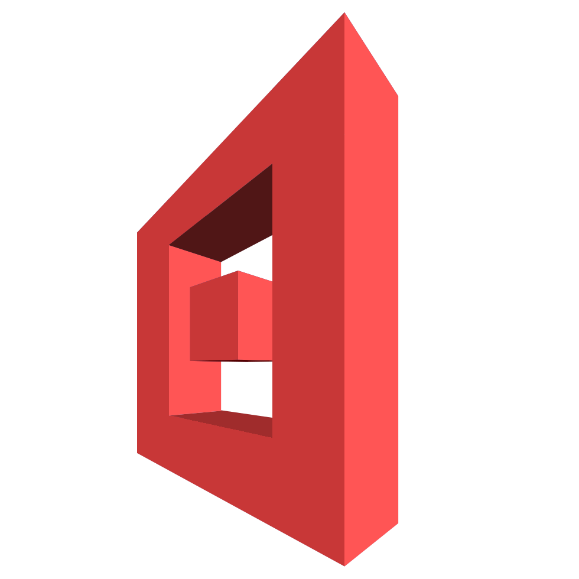

# NOBLOX Unofficial Launcher of Roblox


**NOBLOX Launcher** for friends. It has been conceived as an attempt to integrate the popular video game **ROBLOX®** with the **Linux®** operating system environment. This is a necessity because in Roblox, players join games directly from within the game's website, while the only way to currently launch Roblox on Linux is as a Windows application, with the use of the **Wine** compatibility layer. The aforementioned setup would thus also require players to install Windows web browsers on their computers, and use them to launch the game, something that proves very uncomfortable.

I say *would require* - because that's exactly the problem that NOBLOX Launcher solves. By creating and maintaining a compatibility layer between Roblox and native Linux web browsers, we make possible that you experience the game on Linux with just as much ease as you would on a natively supported platform.

## Requirements
Just [what the game itself requires](https://en.help.roblox.com/hc/en-us/articles/203312800-Computer-Hardware-Operating-System-Requirements), except we also ~~support~~ *hope that it works on* Linux. Also, **Wine 6.11 or newer** is required. Really.

## Usage
Clone the git repository somewhere and launch the script. Congratulations, it should now work. Try to launch a Roblox game.

Oh... you want, like... More elaborate instructions? Here you go:

1. Download the latest available version of the launcher [from here](https://github.com/newbthenewbd/NOBLOX-Launcher/archive/stable.zip).
2. Unzip it somewhere, go into the directory that you just unzipped, and launch the script.
3. Roblox should now be installed, the launcher configured and you may remove the downloaded files. Do not remove or mess with the directory `NOBLOX-Launcher` in your home directory, though - that's where the launcher gets installed!

You may easily perform the installation on the terminal, too:
```
wget https://github.com/newbthenewbd/NOBLOX-Launcher/archive/stable.zip
unzip stable.zip
cd NOBLOX-Launcher-stable
/bin/sh nobloxLauncher.sh
```

## Nagging for Donations
Donations may or may not help keep this project up to date and working - but I will certainly be very thankful for each and every one that appears. :)

[](https://www.paypal.com/cgi-bin/webscr?cmd=_donations&business=sendmoney%40go2%2epl&lc=US&item_name=Donate%20to%20the%20GitHub%20user%20newbthenewbd&currency_code=USD&bn=PP%2dDonationsBF%3abtn_donateCC_LG%2egif%3aNonHosted)

## Notice
ROBLOX® is a registered trademark of Roblox Corporation. We are not affiliated, associated, authorized, endorsed by or in any way officially connected to Roblox Corporation.

Linux® is the registered trademark of Linus Torvalds in the U.S. and other countries. We are not affiliated, associated, authorized, endorsed by or in any way officially connected to Linus Torvalds.

Other product names mentioned herein are for identification purposes only and might be trademarks of their respective companies.
